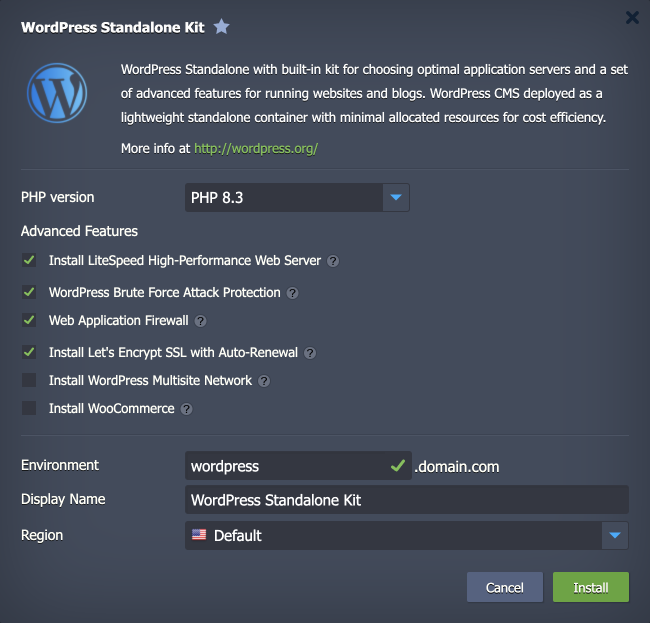

 

# Cost-Effective Wordpress Standalone Kit

Out-of-the-box automated **WordPress Standalone** application solution for cost-effective WordPress installation inside a single lightweight container for running small and medium-sized projects.

## WordPress Standalone Topology

This package creates a dedicated WordPress environment with a set of built-in advanced features on top of efficient single-container topology. Based on your preferences, you can choose between the **LLSMP** (Linux + LiteSpeed + MariaDB + PHP) or **LEMP** (Linux + NGINX + MariaDB + PHP) templates. Your WordPress standalone container will automatically run the following components:

- a PHP-based application server (either LiteSpeed or NGINX)
- a MariaDB database server
- a Redis high-performance RAM-allocated data structure store
- additional features can be enabled via the advanced settings

## Deployment to Cloud

To get your WordPress Standalone solution, click the "**Deploy to Cloud**" button below, specify your email address within the widget, choose one of the [Virtuozzo Public Cloud Providers](https://www.virtuozzo.com/application-platform-partners/), and confirm by clicking **Install**.

> If you already have a Virtuozzo Application Platform (VAP) account, you can deploy this solution from the [Marketplace](https://www.virtuozzo.com/application-platform-docs/marketplace/) or [import](https://www.virtuozzo.com/application-platform-docs/environment-import/) a manifest file from this repository.

## Installation Process

In the opened installation window at the VAP dashboard, customize your WordPress standalone application by selecting the necessary options:

- **PHP version** selector allows choosing the required PHP version for your WordPress application.
- **LiteSpeed High-Performance Web Server** installs LLSMP container based on [LiteSpeed Web Server](https://www.virtuozzo.com/application-platform-docs/litespeed-web-server/). This option provides the highest possible speed of website content delivery to clients via modern [HTTP/3](https://www.virtuozzo.com/application-platform-docs/http3/) protocol. If you untick this option, the LEMP container will be installed using the NGINX web server. The following two additional features are available only for LiteSpeed-based installations:
  - **[Brute Force Attack Protection](https://www.litespeedtech.com/support/wiki/doku.php/litespeed_wiki:config:wordpress-protection)** secures the WordPress admin panel by limiting failed login attempts. The default action is *Throttle*, and the number of allowed attempts is *100*.
  - **[Web Application Firewall](https://www.litespeedtech.com/support/wiki/doku.php/litespeed_wiki:waf)** (WAF) enables/disables the feature that protects your WordPress website by applying rules for filtering out attacking requests by checking for known attack signatures.
  > **Note:** Refer to the [LiteSpeed Web Server](https://www.virtuozzo.com/application-platform-docs/litespeed-web-server/) documentation for more details on these features and their configuration.
- **[Let's Encrypt SSL with Auto-Renewal](https://www.virtuozzo.com/company/blog/free-ssl-certificates-with-lets-encrypt/)** add-on issues and uses a trusted, free certificate for a custom domain. The built-in functionality employs periodical renewal to prevent certificate expiration. The appropriate notifications are sent by email.
- **[WordPress Multisite Network](https://wordpress.org/support/article/glossary/#multisite)** enables/disables the same-named feature. It allows the application to act as a WordPress network hub, where the network can comprise several websites. With this built-in feature and platform automation, you can create an independent network of websites and invite others to develop their sites on the same network, even for commercial usage.
- **[WooCommerce](https://wordpress.org/plugins/woocommerce/)** is a free, open-source WordPress plugin that adds e-commerce functionality to your WordPress website. Enable this option to automatically install this outstanding platform for a store of any size hosted on your WordPress standalone application.

Lastly, specify **Environment** name, **Display Name**, choose availability **Region** (if available), and click **Install**. The WordPress Standalone environment will be automatically created and configured according to the selected options in a few minutes.
