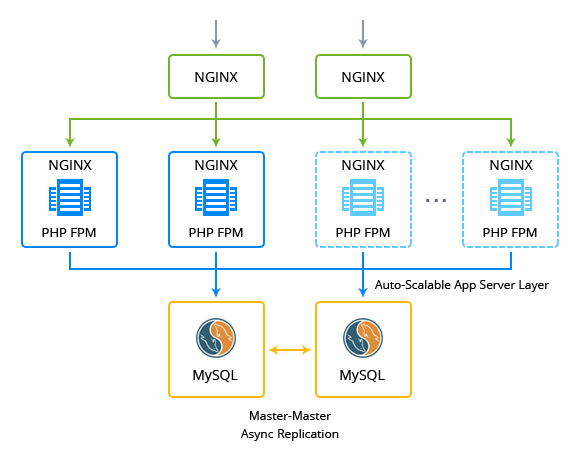

## This package is outdated. Please refer to more advanced version [here](https://github.com/jelastic-jps/wordpress-cluster)

## WordPress Cluster + Lsyncd

The JPS package deploys WordPress Cluster that initially contains 2 load balancers, 2 application servers and 2 database containers. The package provides high availability for each layer and autoscaling for application server layer out-of-the-box.

### Highlights
This package is designed to handle big load spikes by adjusting the allocated resources and topology configuration on the fly with a help of automatic vertical and horizontal scaling. As result, it provides very cost effective solution for websites and blogs with variable load.
File synchronization between compute nodes is based on Lsycnd and rsyncd services. Cluster solution based on Jelastic stacks as: nginx load balancer, nginxphp , mysql57.

### Environment Topology

### Specifics

Layer                |     Server    | Number of CTs   by default | Cloudlets per CT   (reserved/dynamic) | Options
-------------------- | --------------| :----------------------------: | :---------------------------------------: | :-----:
LB                   |  NGINX        |       2                        |           1 / 8                           | 1 [public IP](https://docs.jelastic.com/public-ipv4) per CT 
AS                   | NGINX PHP FPM |       2                        |           1 / 16                          | -
DB                   |    MySQL      |       2                        |           1 / 8                           | -

* LB - Load balancing
* AS - Application server 
* DB - Database 
* CT - Container

**WordPress Version**: 4.2.1  
**PHP Engine**: PHP 5.4.0 
**MySQL Database**: 5.7.12

### Deployment

In order to get this solution instantly deployed, click the "Get It Hosted Now" button, specify your email address within the widget, choose one of the [Jelastic Public Cloud providers](https://jelastic.cloud) and press Install.

To deploy this package to Jelastic Private Cloud, import [this JPS manifest](../../../raw/master/wordpress-cluster/manifest.jps) within your dashboard ([detailed instruction](https://docs.jelastic.com/environment-export-import#import)).

More information about Jelastic JPS package and about installation widget for your website can be found in the [Jelastic JPS Application Package](https://github.com/jelastic-jps/jpswiki/wiki/Jelastic-JPS-Application-Package) reference.

