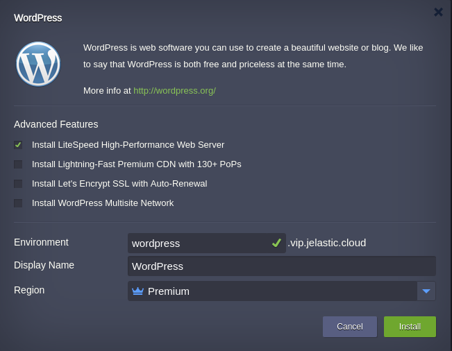

##  Wordpress

Out-of-the-box automated Enterprise WordPress application solution for large businesses and mission-critical sites.
The JPS package deploys one of single container topologies:  

  * **LEMP**: *NGINX* application server, *PHP*, *MariaDB* database server, *Redis* high-performance RAM-allocated data structure store  
  or  
  * **LLSMP**: *LiteSpeedNGINX* application server, *PHP*, *MariaDB* database server, *Redis* high-performance RAM-allocated data structure store  
  

### Highlights
This package is designed to handle big load spikes by adjusting the allocated resources with a help of vertical scaling. As result, it provides very cost effective solution for websites and blogs.

### Deployment

In order to get this solution instantly deployed, click the **Get It Hosted Now** button, specify your email address within the widget, choose one of the [Jelastic Public Cloud providers](https://jelastic.cloud) and press Install.  

To deploy this package to Jelastic Private Cloud, import [this JPS manifest](../../../raw/master/wordpress/manifest.jps) within your dashboard ([detailed instruction](https://docs.jelastic.com/environment-export-import#import)).

If required use Advanced Features:  

  * The *WordPress* application can be handled by either **[LiteSpeed Web Server](https://jelastic.com/blog/litespeed-web-server/)**(if chosen) or **[NGINX PHP](https://docs.jelastic.com/nginx-php)** server  
  * **[Premium CDN](https://jelastic.com/blog/enterprise-cdn-verizon-integration/)** integration in order to provide Lightning-fast static assets loading  
  * **[Let's Encrypt SSL](https://jelastic.com/blog/free-ssl-certificates-with-lets-encrypt/)** Add-On allows to get your traffic secured and along with LiteSpeed Web Server provides **[HTTP/3](https://docs.jelastic.com/http3)** protocol support. This option stipulates the public IP address wil be added to your container  
  * **WordPress Multisite Network**. WordPress comes with built-in Multisite feature for the cases when the massive WordPress installations are required running under the hood virtually unlimited quantity on WordPress sites using one hosting account. You can enable this functionality picking up the respective checkbox. As a result, your application will be acting as WordPress network hub, where the network can comprise a number of websites. With this built-in feature and Jelastic automation, any user can create own independent network of websites and invite others to create their own sites on the network even for commercial usage.

Upon successfull installation, you’ll see the appropriate pop-up with access credentials to your administration WordPress panel, whilst the same information will be duplicated to your email box.

More information about Jelastic JPS package and about installation widget for your website can be found in the [Jelastic JPS Application Package](https://github.com/jelastic-jps/jpswiki/wiki/Jelastic-JPS-Application-Package) reference.
