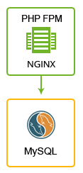

##  Wordpress

The JPS package deploys WordPress that initially contains 1 application server and 1 database container. The package provides vertical scalling per node and horizontal scaling for each layer out-of-the-box.

### Highlights
This package is designed to handle big load spikes by adjusting the allocated resources and topology configuration with a help of vertical and horizontal scaling. As result, it provides very cost effective solution for websites and blogs with variable load.

### Environment Topology

### Specifics

Layer                |     Server    | Number of CTs   by default | Cloudlets per CT   (reserved/dynamic) | Options
-------------------- | --------------| :----------------------------: | :---------------------------------------: | :-----:
AS                   | NGINX PHP FPM |       1                        |           1 / 16                          | -
DB                   |    MySQL      |       1                        |           1 / 8                           | -

* AS - Application server
* DB - Database
* CT - Container

**WordPress Version**: WordPress Latest 
**PHP Engine**: PHP 7.3.0 
**MySQL Database**: 8.0.13

### Deployment

In order to get this solution instantly deployed, click the "Get It Hosted Now" button, specify your email address within the widget, choose one of the [Jelastic Public Cloud providers](https://jelastic.cloud) and press Install.

To deploy this package to Jelastic Private Cloud, import [this JPS manifest](../../../raw/master/wordpress/manifest.jps) within your dashboard ([detailed instruction](https://docs.jelastic.com/environment-export-import#import)).

More information about Jelastic JPS package and about installation widget for your website can be found in the [Jelastic JPS Application Package](https://github.com/jelastic-jps/jpswiki/wiki/Jelastic-JPS-Application-Package) reference.
